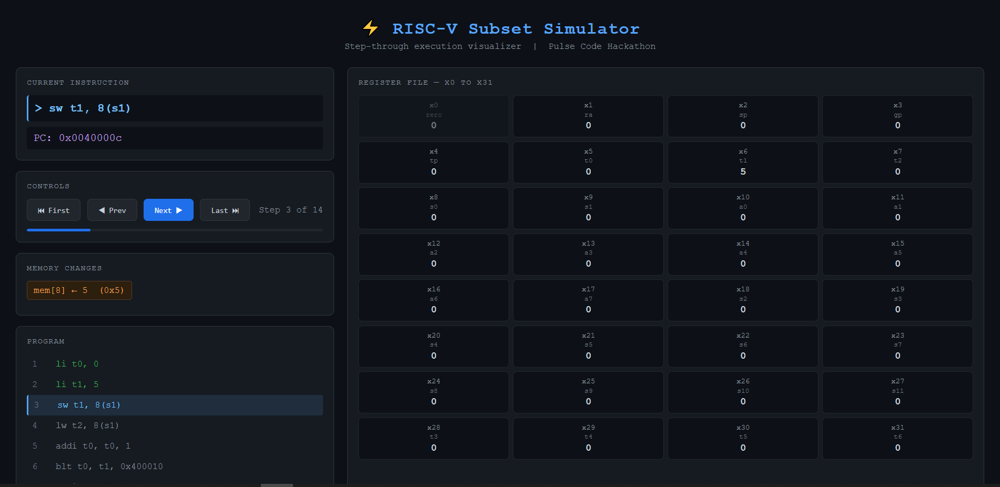

# RISC-V Simulator

A lightweight RISC-V 32-bit instruction set simulator written in C, built for the **Pulse Code Hackathon** by CIS Community. It simulates assembly execution step-by-step, displaying register and memory state after each instruction, similar to the Venus simulator (venus.cs61c.org).



A browser-based visual debugger is included, powered by a lightweight Python server, allowing you to write assembly directly in the browser and step through execution in real time.

---

## Supported Instructions (29 Total)

**R-Type (10):**
`add` `sub` `and` `or` `xor` `sll` `srl` `sra` `slt` `sltu`

**I-Type (10):**
`addi` `andi` `ori` `xori` `slti` `sltiu` `slli` `srli` `srai` `lw`

**S-Type (1):**
`sw`

**B-Type (4):**
`beq` `bne` `blt` `bge`

**Pseudo Instructions (4):**
`li` `mv` `nop` `j`

---

## How to Run

### Option A — CLI Mode

**1. Compile:**
```bash
make
```

**2. Write your assembly** in `program.asm`. Example:
```asm
# Add two numbers
li t0, 5
li t1, 7
add t2, t0, t1
```

**3. Run:**
```bash
./risc_v_sim
```

---

### Option B — Visual Debugger (Browser UI)

**1. Compile and run with the JSON flag:**
```bash
make
./risc_v_sim -json
```

**2. Start a local server in the project folder:**
```bash
python3 -m http.server 8000
```

**3. Open your browser and go to:**
```
http://localhost:8000/visualizer.html
```

**4. To run a new program, edit `program.asm`, run `./risc_v_sim -json` again, and refresh the page.**

---

## Visual Debugger Features

- **Live assembly editor** — write or paste RISC-V assembly directly in the browser
- **Step-through execution** — step forward and backward through every instruction
- **Register file display** — all 32 registers update in real time, changed registers highlight in green
- **Memory tracking** — store instructions show the address and value written
- **Program view** — tracks which instruction is currently executing, completed instructions shown in green
- **Keyboard navigation** — use arrow keys to step through execution
- **Progress bar** — shows how far through the program execution has reached

---

## CLI Output Format
```
> li t0, 5
PC: 0x00400004
Registers:
x0: 0 (zero)  x1: 0 (ra)  x2: 0 (sp)  x3: 0 (gp)
x4: 0 (tp)    x5: 5 (t0)  x6: 0 (t1)  x7: 0 (t2)
...

Execution completed. Result: t2 = 12
```

---

## Example Programs

**Simple addition:**
```asm
li t0, 5
li t1, 7
add t2, t0, t1
```

**Counting loop:**
```asm
li t0, 0
li t1, 5
loop:
    addi t0, t0, 1
    blt t0, t1, loop
```

**Store and load:**
```asm
li t0, 42
sw t0, 0(zero)
li t0, 0
lw t1, 0(zero)
```

**Fibonacci:**
```asm
li t0, 0
li t1, 1
li t2, 10
li t3, 0
loop:
    add t4, t0, t1
    mv t0, t1
    mv t1, t4
    addi t3, t3, 1
    blt t3, t2, loop
```

---

## Project Structure
```
riscv-sim/
├── main.c           — entry point, file reading, execution loop
├── cpu.c            — instruction execution, CPU state
├── cpu.h            — CPU struct, instruction struct, constants
├── parser.c         — tokenizer, parser, label resolver
├── parser.h         — parser function declarations
├── utils.c          — print utilities, JSON output
├── utils.h          — utility function declarations
├── Makefile         — build configuration
├── simulator.html  — browser-based step-through debugger
└── program.asm      — assembly input for CLI mode
```

---

## Architecture

The simulator follows a classic fetch-decode-execute pipeline:

1. **Two-pass parsing** — first pass scans for labels and records their addresses, second pass parses all instructions into an internal representation
2. **Array-based execution** — all instructions are loaded into an array and executed using the PC as an index, enabling correct branch and jump behavior
3. **Separate memory spaces** — instruction memory and data memory are kept separate, with data memory byte-addressed and little-endian
4. **Step-by-step output** — after every instruction, the full register file and any memory changes are displayed
5. **JSON export** — running with `-json` flag outputs the execution trace to `output.json`. Run `./risc_v_sim -json` to generate it, then serve it with `python3 -m http.server 8000` and open `http://localhost:8000/visualizer.html` — the page fetches `output.json` automatically and loads the visualizer.

---

## Limitations

- Memory is limited to 4096 bytes for data
- Maximum 256 instructions per program
- Maximum 256 labels per program
- Only a subset of the full RISC-V ISA is supported
- No floating point instructions
- Visual debugger requires Python 3 and a modern browser

---

*Built for Pulse Code — CIS Community Hackathon*
